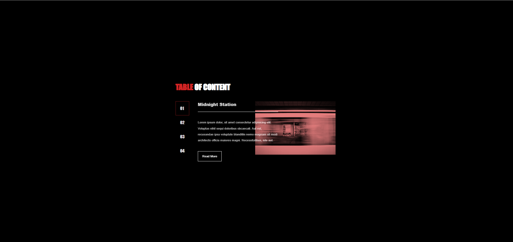

# Accessible Tabs
This project implements accessible tabs using HTML, CSS, and JavaScript. The tabs are designed to be navigable and usable for all users, including those who rely on assistive technologies. Below is a brief guide on how to use and customize the accessible tabs.

## Images


## Table of Contents
* [Overview](#overview)
* [Usage](#usage)
* [Structure](#structure)
* [Styling](#styling)
* [JavaScript](#javascript)

## Overview
The project includes a set of tabs, each containing a title, content, and an associated image. Users can switch between tabs using a list of indexes or by clicking on the tabs directly. The content is designed to be readable and interactive.

## Usage
1. Clone the repository:

```
git clone https://github.com/nferdica/accessible-tabs
```
2. Open the index.html file in your web browser.
3. Explore the tabs by clicking on the tab titles or using the provided list of indexes.

## Structure
* __Indexes__: A list of indexes is provided for easy navigation. Each index corresponds to a tab.

* __Tabs__: The main section contains a list of tabs, each consisting of a title, content, and an associated image.

## Styling
The project includes a basic stylesheet (`style.css`) for styling the tabs. You can customize the appearance by modifying this stylesheet to suit your design preferences.

## JavaScript
The functionality of the accessible tabs is implemented using JavaScript (`script.js`). The script handles tab switching and ensures a smooth and accessible user experience.

Feel free to explore and modify the JavaScript file to add additional features or customize the behavior of the tabs.

For any questions or issues, please open an issue on the GitHub repository.

Happy coding!